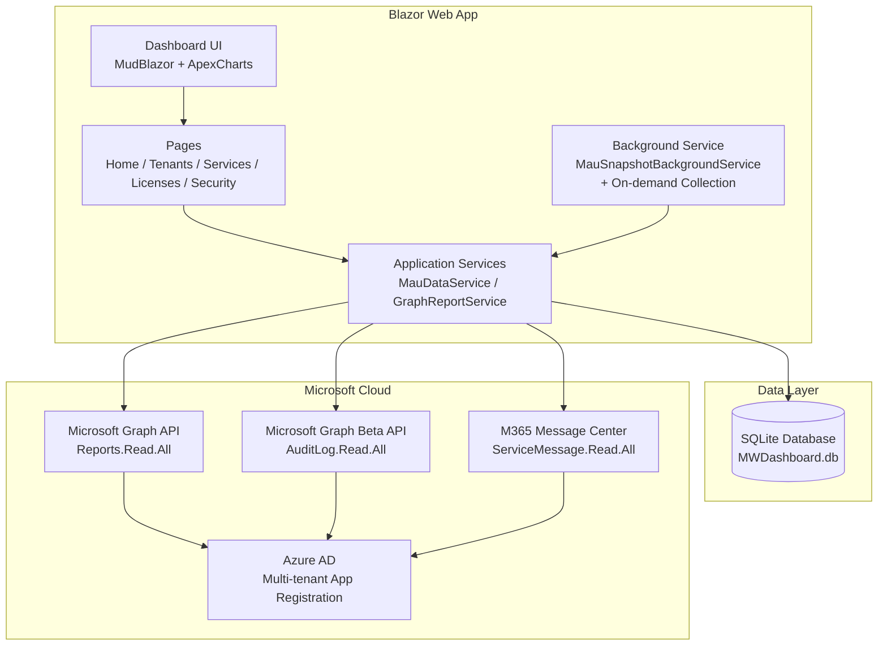
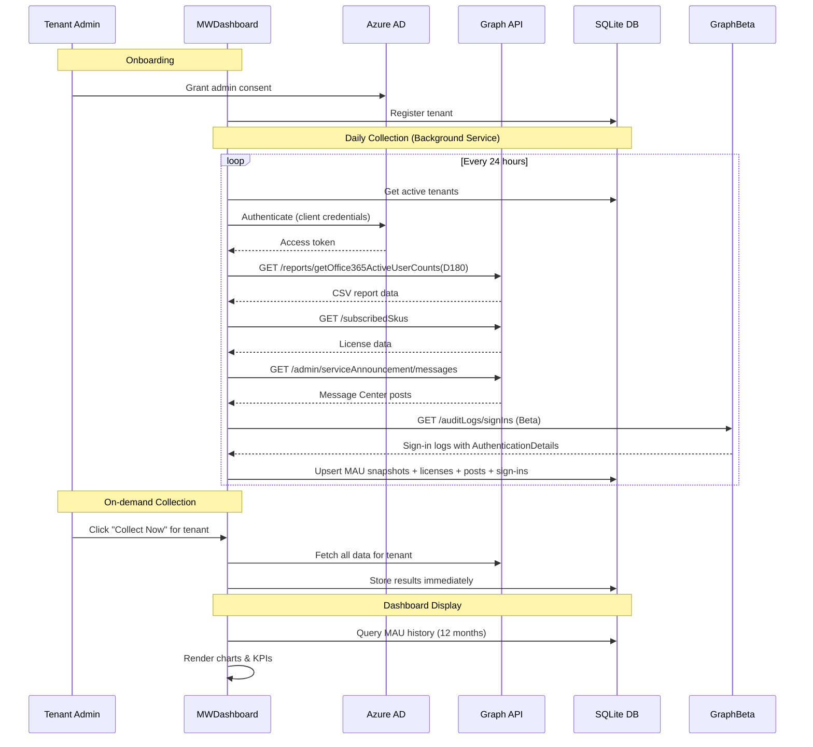
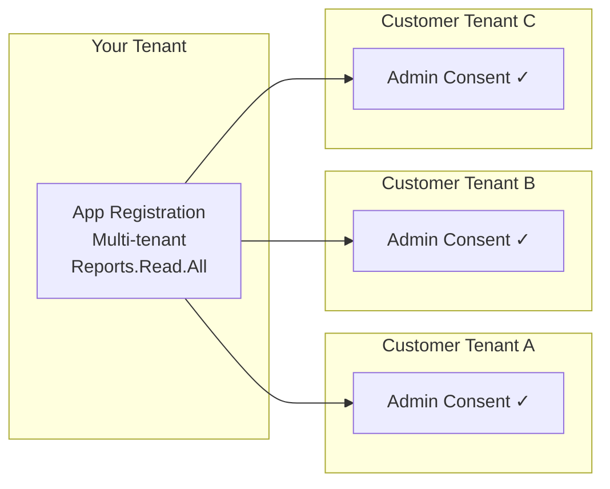

# Modern Workplace Dashboard (MWDashboard)

A Blazor Web App that visualizes Monthly Active Users (MAU) across Microsoft 365 and Modern Workplace services, pulling data from the Microsoft Graph Reports API. Includes license adoption analytics, security sign-in monitoring, and M365 Message Center integration.

## Tech Stack

- **.NET 10** Blazor Web App (Server interactivity)
- **MudBlazor** — UI component library
- **Blazor-ApexCharts** — Interactive charts
- **Microsoft Graph SDK** — Usage reports & license data
- **Microsoft Graph Beta SDK** — Sign-in logs with full authentication details (Entra ID P1/P2)
- **EF Core + SQLite** — Local data persistence & history accumulation
- **Azure Identity** — Multi-tenant authentication

## Architecture



## Data Flow



## Multi-Tenant Model



## Project Structure

```
MWDashboard/
├── Components/
│   ├── Layout/
│   │   ├── MainLayout.razor        # MudBlazor shell (AppBar, Drawer, dark/light toggle)
│   │   └── NavMenu.razor           # Navigation menu
│   ├── Pages/
│   │   ├── Home.razor              # MAU dashboard with KPIs & charts
│   │   ├── Services.razor          # Per-service sparklines & comparison chart
│   │   ├── Licenses.razor          # License adoption, date picker, recommendations, Message Center
│   │   ├── Security.razor          # Security sign-in monitoring (Entra, Defender, Intune)
│   │   └── Tenants.razor           # Tenant registration, consent URLs, collect now button
│   ├── App.razor
│   └── _Imports.razor
├── Data/
│   └── MauDbContext.cs             # EF Core context (SQLite) — 5 DbSets
├── Models/
│   ├── MauSnapshot.cs              # MauSnapshot, TenantInfo, LicenseSnapshot, MessageCenterPost, SecuritySignInSummary
│   └── M365Services.cs             # M365 + Security service name constants
├── Services/
│   ├── GraphReportService.cs       # Graph API integration (v1.0 + Beta)
│   ├── MauDataService.cs           # DB read/write operations (9 methods)
│   └── MauSnapshotBackgroundService.cs  # Scheduled + on-demand data collection
├── Program.cs
├── appsettings.json
└── MWDashboard.csproj
```

## Getting Started

### Prerequisites

- .NET 10 SDK
- An Azure AD multi-tenant app registration with:
  - `Reports.Read.All` (Application)
  - `Organization.Read.All` (Application)
  - `AuditLog.Read.All` (Application) — for Security page sign-in data
  - `ServiceMessage.Read.All` (Application) — for Message Center posts
- Entra ID P1 or P2 on target tenants (required for sign-in log access)

### Configuration

1. Update `appsettings.json` with your `ClientId` and `TenantId`
2. Store the client secret securely:
   ```powershell
   dotnet user-secrets init
   dotnet user-secrets set "AzureAd:ClientSecret" "your-secret"
   ```

### Run

```powershell
cd MWDashboard
dotnet run
```

The SQLite database is auto-created on first run (Development mode).

### Onboarding a Tenant

1. Navigate to `/tenants`
2. Generate an admin consent URL and send it to the customer's Global Admin
3. After consent is granted, register the tenant ID and name
4. Click the **Collect Now** button (cloud sync icon) to immediately pull data
5. The background service will also collect data automatically on the next 24-hour cycle

## Features

All charts include axis labels (Y-axis: metric name, X-axis: time/category) and bottom-positioned legends identifying each data series. Chart text (legends, axis labels, titles) automatically adapts to dark/light mode via MudBlazor CSS variables. All pages show an indeterminate progress bar while loading data (on initial load and when the tenant filter changes).

### Global Tenant Selector
- **Persistent tenant filter** in the AppBar — visible on every page, uses standard `MudMenu` with label + dropdown arrow for reliable click handling
- Select individual tenants, all, or none via dropdown menu with checkboxes
- **Multi-tenant attribution** — when multiple tenants are selected, all charts show series labeled `"Service (TenantName)"` and all tables include a Tenant column so data origin is always clear
- **Single-tenant mode** — when only one tenant is selected, labels stay clean without redundant tenant names
- Selector immediately reflects tenant activation/deactivation/deletion — deactivated tenants are removed from both the list and current selection in real-time

### Dashboard (`/`)
- KPI cards showing total active users, Teams/Exchange/SharePoint/OneDrive counts
- 12-month MAU trend line chart (per-tenant series in multi-tenant view)
- Per-service bar chart comparison (grouped by tenant when multi-tenant)
- License utilization table (with Tenant column in multi-tenant view)

### Services (`/services`)
- Per-service sparkline cards with aggregated user counts across selected tenants
- Combined multi-service comparison line chart (per-tenant series in multi-tenant view)

### Licenses & Adoption (`/licenses`)
- **Date range picker** — filter all charts and data by custom time period, with **Reset** button to restore full available range
- **Data availability indicator** — shows the actual historical data range from Graph reports (uses `ReportDate`, not collection timestamp); data accumulates beyond the 180-day Graph API limit
- **Month-over-month adoption chart** — per-service active users as % of total licenses, adapts to selected date range, Y-axis 0–100% with 2 decimal places. Chart automatically re-renders when date range changes via `@key` forcing component recreation
- **Automated recommendations** — scale up/down/monitor based on utilization thresholds and trend analysis
- **License detail table** — searchable with utilization bars and recommendation chips
- **M365 Message Center** — displays service announcements and advisories with:
  - **Multi-select filter chips** for Category and Severity (toggle on/off to combine filters)
  - **Collapsible month groups** (yyyy-MM) via expansion panels — individually expand/collapse for easy scanning of large post volumes
  - Tenant column visible in multi-tenant view
  - Inline severity color coding and "no matches" feedback

### Security Services (`/security`)
- **Tenant Entra ID License Levels table** — auto-detects P1/P2/Free tier from stored license SKUs per tenant, shows which tenants can provide sign-in and MFA data
- **Sign-in activity chart** (30 days) — success vs failure area chart with axis labels and legend
- **Per-service breakdown** — Defender, Entra ID, Intune, Sentinel cards with failure rates
- **MFA adoption rate** — gauge with percentage and actionable recommendations
- **True MFA data** — uses Microsoft Graph Beta API `AuthenticationDetails` (counts non-password auth methods that succeeded). Only available from tenants with Entra ID P1/P2
- **Clear data availability notes** — explains exactly what's available per license tier and that Free-tier tenants cannot expose audit log data via Graph

### Tenant Management (`/tenants`)
- Register/deregister tenants — form auto-resets after successful registration with auto-dismissing success message
- Admin consent URL generator with clipboard copy
- **Collect Now button** — triggers immediate data collection for a specific tenant
- Toggle tenant active/inactive — global tenant selector updates immediately when toggling or deleting tenants

## Required Permissions

The app registration needs the following **Application** permissions (not Delegated):

| Permission | Purpose | Notes |
|-----------|---------|-------|
| `Reports.Read.All` | MAU usage reports | Core functionality |
| `Organization.Read.All` | Subscribed SKUs / license data | License page |
| `ServiceMessage.Read.All` | M365 Message Center posts | License page — Message Center section |
| `AuditLog.Read.All` | Entra sign-in logs | Security page — requires Entra ID P1/P2 on target tenant |

**Important:** After adding permissions in Azure Portal → App Registrations → API Permissions, you must **re-grant admin consent** for each tenant. Either:
- Send the tenant admin the consent URL generated on the Tenants page, or
- Click "Grant admin consent" in the Azure Portal if you're in the home tenant

If a tenant doesn't have Entra ID P1/P2, sign-in log collection will gracefully fail and log a warning — all other data collection continues normally.

## Key Constraints

| Constraint | Mitigation |
|-----------|-----------|
| Graph reports max D180 (~6 months) | Background service snapshots monthly; history accumulates over time |
| Admin consent required per tenant | Built-in consent URL generator on Tenants page |
| Concealed usernames in some tenants | Dashboard uses aggregated counts only |
| Graph API throttling | Retry with exponential backoff (SDK built-in) |
| Sign-in logs require Entra ID P1/P2 | Security page gracefully shows info alert if unavailable |
| Graph Beta SDK is preview | Used only for sign-in endpoint; stable API used elsewhere |

## License

Proprietary — internal use only.
