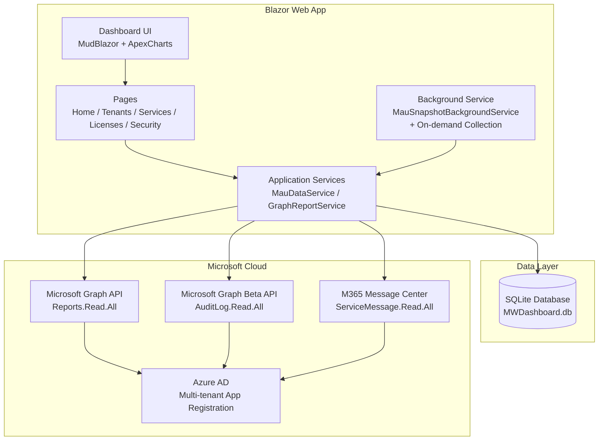
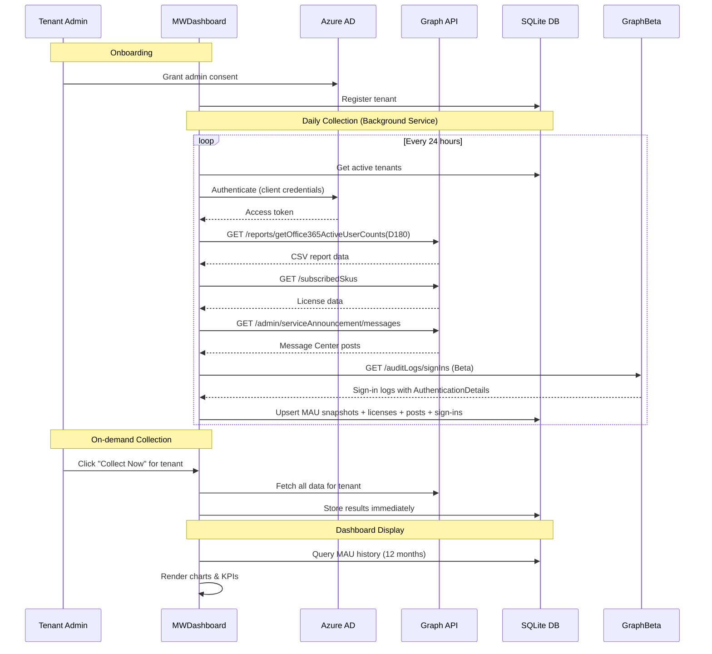
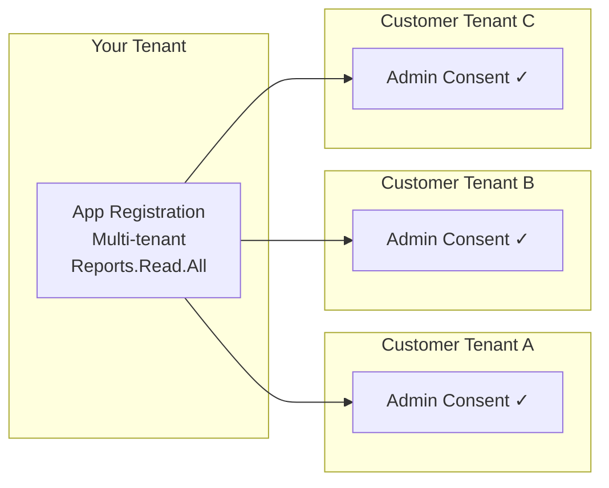

# Architecture

## System Overview



## Data Flow



## Multi-Tenant Model



## Project Structure

```
MWDashboard/
├── Components/
│   ├── Layout/
│   │   ├── MainLayout.razor        # MudBlazor shell (AppBar, Drawer, dark/light toggle)
│   │   ├── TenantSelector.razor    # Global tenant filter component
│   │   └── NavMenu.razor           # Navigation menu
│   ├── Pages/
│   │   ├── Home.razor              # MAU dashboard with KPIs & charts
│   │   ├── Services.razor          # Per-service sparklines & comparison chart
│   │   ├── Licenses.razor          # License adoption, date picker, recommendations, Message Center
│   │   ├── Security.razor          # Security sign-in monitoring (Entra, Defender, Intune)
│   │   └── Tenants.razor           # Tenant registration, consent URLs, collect now button
│   ├── App.razor
│   └── _Imports.razor
├── Data/
│   └── MauDbContext.cs             # EF Core context (SQLite) — 5 DbSets
├── Models/
│   ├── MauSnapshot.cs              # MauSnapshot, TenantInfo, LicenseSnapshot, MessageCenterPost, SecuritySignInSummary
│   └── M365Services.cs             # M365 + Security service name constants
├── Services/
│   ├── GraphReportService.cs       # Graph API integration (v1.0 + Beta)
│   ├── MauDataService.cs           # DB read/write operations (9 methods)
│   ├── TenantFilterService.cs      # Scoped state service for tenant selection
│   └── MauSnapshotBackgroundService.cs  # Scheduled + on-demand data collection
├── docs/
│   ├── architecture.md             # This file
│   ├── features.md                 # Detailed feature documentation
│   └── permissions.md              # Required permissions & consent guide
├── Program.cs
├── appsettings.json
└── MWDashboard.csproj
```

## Key Constraints

| Constraint | Mitigation |
|-----------|-----------|
| Graph reports max D180 (~6 months) | Background service snapshots monthly; history accumulates over time |
| Admin consent required per tenant | Built-in consent URL generator on Tenants page |
| Concealed usernames in some tenants | Dashboard uses aggregated counts only |
| Graph API throttling | Retry with exponential backoff (SDK built-in) |
| Sign-in logs require Entra ID P1/P2 | Security page gracefully shows info alert if unavailable |
| Graph Beta SDK is preview | Used only for sign-in endpoint; stable API used elsewhere |
