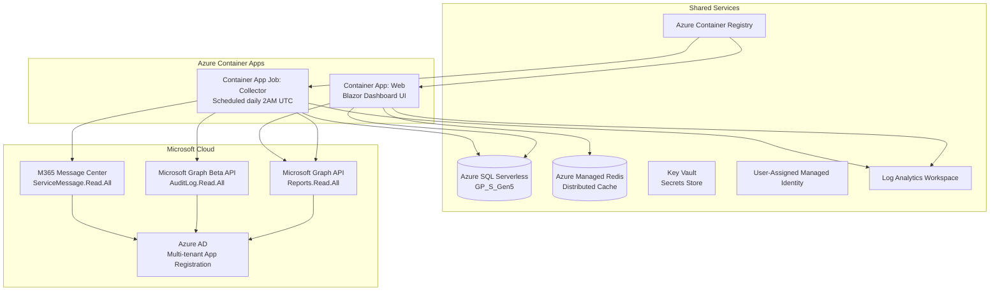
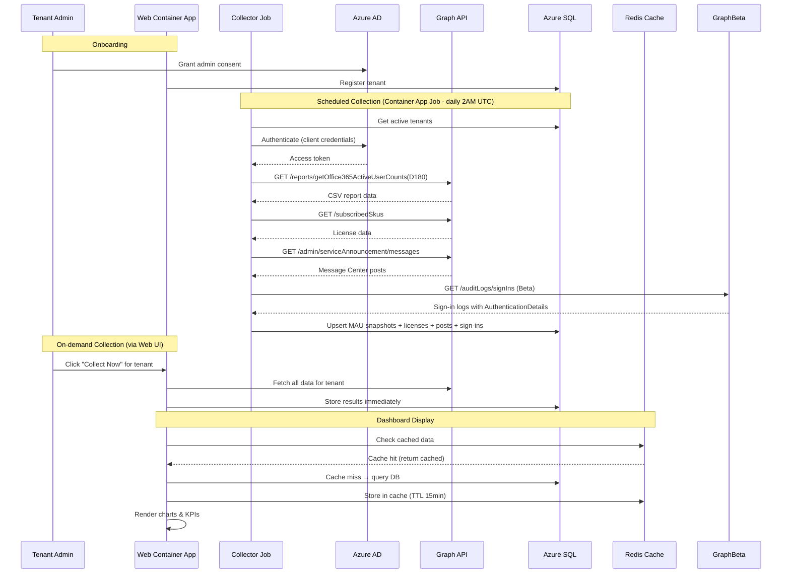
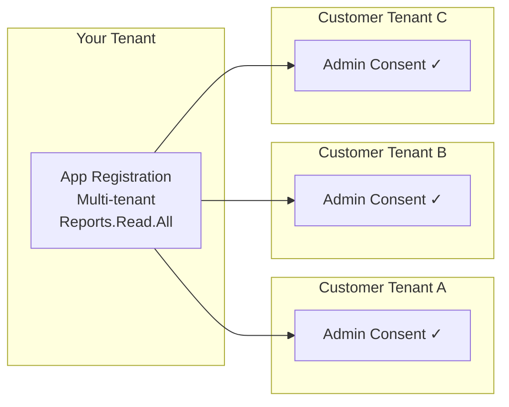

# Architecture

## System Overview



## Data Flow



## Multi-Tenant Model



## Project Structure

```
MWDashboard/
├── azure.yaml                              # azd project definition
├── MWDashboard.slnx                        # Solution file (3 projects)
├── .github/
│   └── workflows/
│       └── deploy.yml                      # GitHub Actions CI/CD pipeline
├── infra/                                  # Bicep infrastructure-as-code
│   ├── main.bicep                          # Resource orchestrator
│   ├── main.bicepparam                     # Parameters (env vars)
│   ├── abbreviations.json                  # Azure naming conventions
│   └── modules/
│       ├── container-registry.bicep        # Azure Container Registry (Basic)
│       ├── container-apps-environment.bicep # Container Apps Environment
│       ├── container-app-web.bicep         # Web UI Container App (ingress, scaling)
│       ├── container-app-job.bicep         # Scheduled job (cron: 0 2 * * *)
│       ├── key-vault.bicep                 # Key Vault (secrets for AD + Redis)
│       ├── log-analytics.bicep             # Log Analytics workspace
│       ├── managed-identity.bicep          # User-Assigned Managed Identity (SQL admin)
│       ├── redis.bicep                     # Azure Managed Redis (Balanced B0)
│       ├── role-assignment.bicep           # Reusable RBAC role assignment
│       └── sql-server.bicep               # Azure SQL Serverless (GP_S_Gen5_1)
├── src/
│   ├── MWDashboard.Shared/                # Shared class library
│   │   ├── Data/
│   │   │   └── MauDbContext.cs            # EF Core context — 5 DbSets
│   │   ├── Models/
│   │   │   ├── MauSnapshot.cs             # All entity models + TenantEntraTier
│   │   │   └── M365Services.cs            # Service name constants
│   │   └── Services/
│   │       ├── GraphReportService.cs      # Graph API integration (v1.0 + Beta)
│   │       ├── MauDataService.cs          # DB read/write operations
│   │       ├── TenantFilterService.cs     # Scoped state service for tenant selection
│   │       └── IDataCollectionService.cs  # Interface for on-demand collection
│   ├── MWDashboard.Web/                   # Blazor Web App → Container App
│   │   ├── Program.cs                     # Redis + output caching, EF Core (SQL Server)
│   │   ├── Services/
│   │   │   └── OnDemandDataCollectionService.cs  # Web-triggered data collection
│   │   ├── Components/
│   │   │   ├── Layout/
│   │   │   │   ├── MainLayout.razor       # MudBlazor shell
│   │   │   │   ├── TenantSelector.razor   # Global tenant filter
│   │   │   │   └── NavMenu.razor          # Navigation
│   │   │   └── Pages/
│   │   │       ├── Home.razor             # MAU dashboard with KPIs & charts
│   │   │       ├── Services.razor         # Per-service comparison
│   │   │       ├── Licenses.razor         # License adoption + Message Center
│   │   │       ├── Security.razor         # Security sign-in monitoring
│   │   │       └── Tenants.razor          # Tenant management
│   │   └── wwwroot/                       # Static assets
│   └── MWDashboard.Job/                   # Data collector → Container App Job
│       └── Program.cs                     # One-shot console app (collects & exits)
└── docs/
    ├── architecture.md                    # This file
    ├── deployment.md                      # Azure deployment & CI/CD guide
    ├── features.md                        # Feature documentation
    └── permissions.md                     # Permissions & consent guide
```

## Key Constraints

| Constraint | Mitigation |
|-----------|-----------|
| Graph reports max D180 (~6 months) | Scheduled job snapshots daily; history accumulates over time |
| Admin consent required per tenant | Built-in consent URL generator on Tenants page |
| Concealed usernames in some tenants | Dashboard uses aggregated counts only |
| Graph API throttling | Retry with exponential backoff (SDK built-in) |
| Azure SQL Serverless cold-start (~60s) | EF Core `EnableRetryOnFailure` (5 retries, 30s max delay) + 60s command timeout |
| Sign-in logs require Entra ID P1/P2 | Security page gracefully shows info alert if unavailable |
| Graph Beta SDK is preview | Used only for sign-in endpoint; stable API used elsewhere |
| Container App Job max 1hr runtime | Sufficient for hundreds of tenants; parallelism=1 ensures serialized collection |

## Caching Strategy

| Layer | Scope | TTL | Purpose |
|-------|-------|-----|---------|
| Output Cache | HTTP responses | 5–15 min | Avoids re-rendering identical dashboard pages |
| Redis Distributed Cache | Cross-instance | Configurable | Shared cache between scaled web replicas |
| In-Memory (fallback) | Single instance | Session lifetime | Local dev when Redis is unavailable |

## Scaling Model

- **Web Container App**: Scales 1–3 replicas based on HTTP concurrency (50 concurrent requests triggers scale-out)
- **Collector Job**: Runs daily at 2:00 AM UTC, scales to zero between runs, max 1 hour execution
- **Azure SQL Serverless**: Auto-pauses after 60 minutes idle, auto-resumes on first connection
- **Redis**: Balanced B0 tier (sufficient for dashboard caching patterns)
