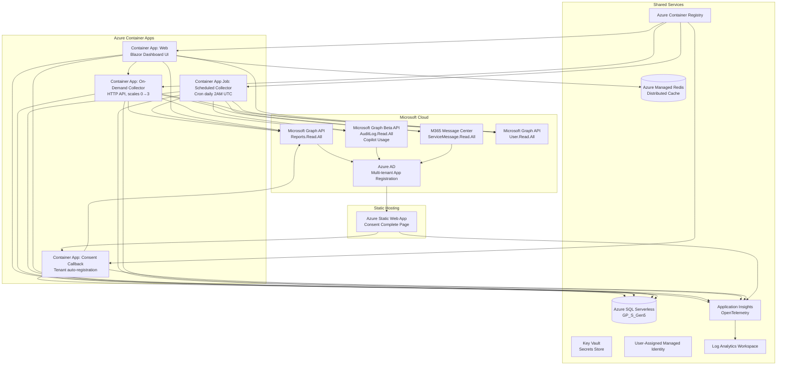
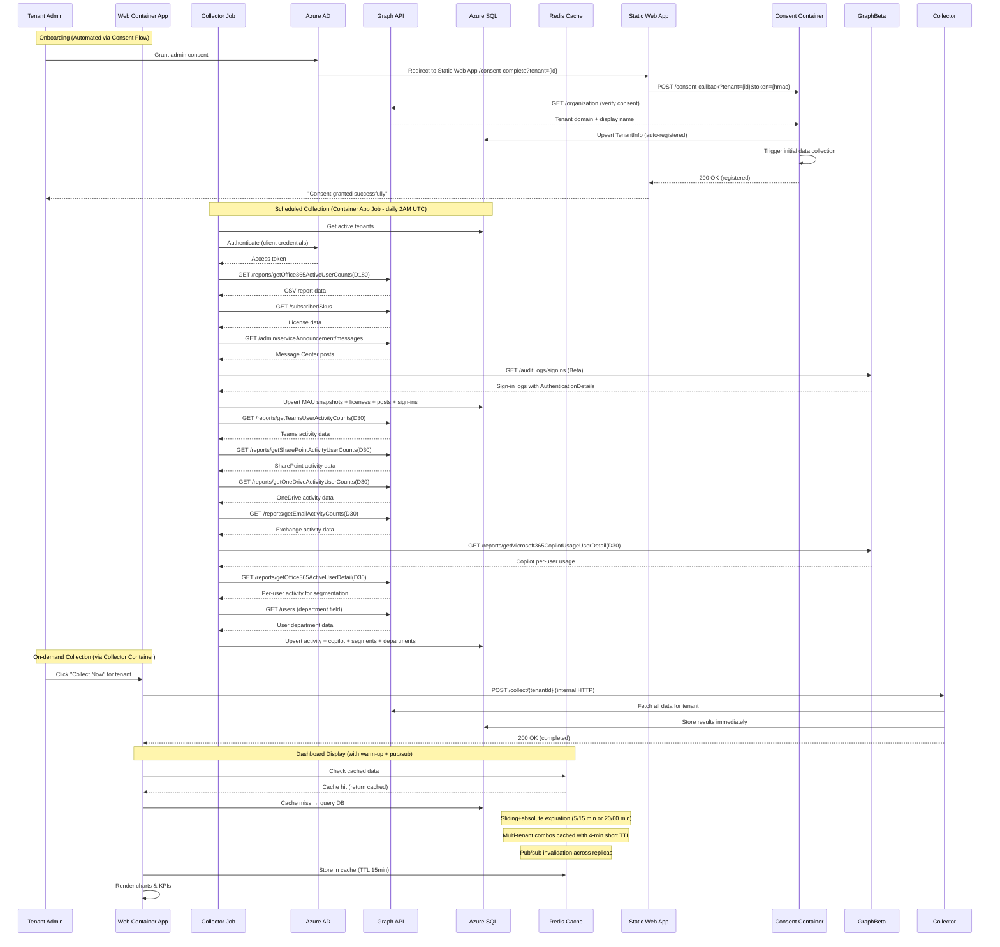
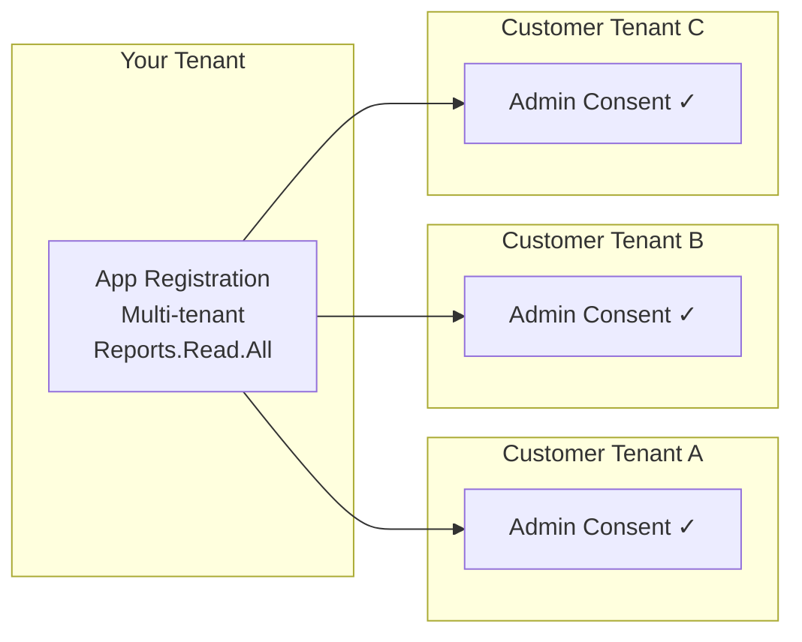
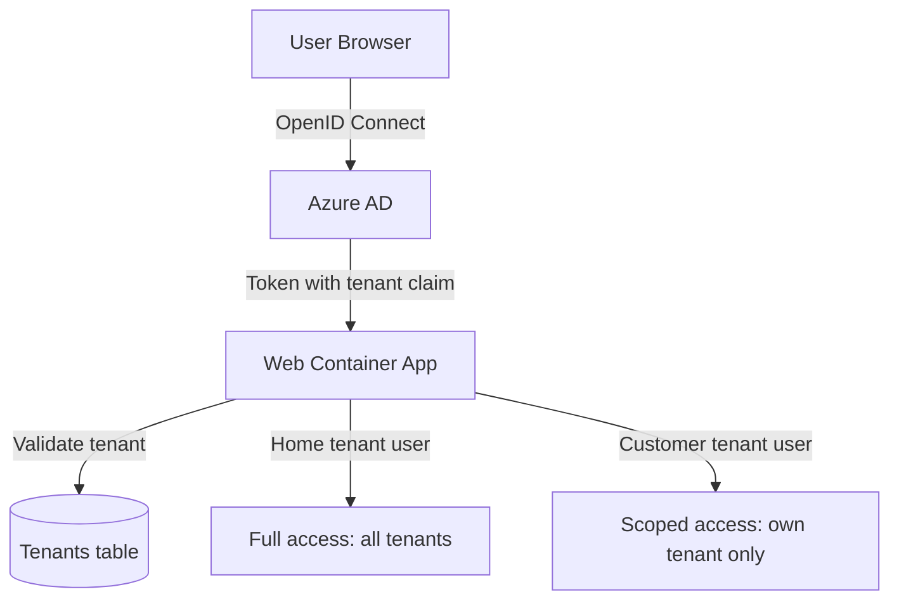

# Architecture

## System Overview



## Data Flow



## Multi-Tenant Model



## Project Structure

```
MWDashboard/
├── azure.yaml                              # azd project definition
├── MWDashboard.slnx                        # Solution file (4 projects)
├── .github/
│   └── workflows/
│       └── deploy.yml                      # GitHub Actions CI/CD pipeline
├── infra/                                  # Bicep infrastructure-as-code
│   ├── main.bicep                          # Resource orchestrator
│   ├── main.bicepparam                     # Parameters (env vars)
│   ├── abbreviations.json                  # Azure naming conventions
│   └── modules/
│       ├── container-registry.bicep        # Azure Container Registry (Basic)
│       ├── container-apps-environment.bicep # Container Apps Environment
│       ├── container-app-web.bicep         # Web UI Container App (ingress, scaling)
│       ├── container-app-collector.bicep   # On-Demand Collector (internal, scales 0→3)
│       ├── container-app-consent.bicep     # Consent Callback (external, scales 0→2)
│       ├── container-app-job.bicep         # Scheduled job (cron: 0 2 * * *)
│       ├── static-web-app.bicep            # Static Web App (consent complete page)
│       ├── key-vault.bicep                 # Key Vault (secrets for AD + Redis + consent)
│       ├── application-insights.bicep      # Application Insights (OpenTelemetry)
│       ├── log-analytics.bicep             # Log Analytics workspace
│       ├── managed-identity.bicep          # User-Assigned Managed Identity (SQL admin)
│       ├── redis.bicep                     # Azure Managed Redis (Balanced B0)
│       ├── role-assignment.bicep           # Reusable RBAC role assignment
│       └── sql-server.bicep               # Azure SQL Serverless (GP_S_Gen5_1)
├── static/
│   └── consent-complete/                   # Azure Static Web App source
│       ├── index.html                      # Consent redirect landing page
│       └── staticwebapp.config.json        # SWA routing + security headers
├── src/
│   ├── MWDashboard.Shared/                # Shared class library
│   │   ├── Data/
│   │   │   └── MauDbContext.cs            # EF Core context — 19 DbSets
│   │   ├── Models/
│   │   │   ├── MauSnapshot.cs             # All entity models + TenantEntraTier
│   │   │   └── M365Services.cs            # Service constants, SKU-to-service mapping, service plan auto-detection
│   │   └── Services/
│   │       ├── GraphReportService.cs      # Graph API integration (v1.0 + Beta)
│   │       ├── MauDataService.cs          # DB read/write operations
│   │       ├── TenantFilterService.cs     # Scoped state service for tenant selection
│   │       └── IDataCollectionService.cs  # Interface for on-demand collection
│   ├── MWDashboard.Web/                   # Blazor Web App → Container App
│   │   ├── Program.cs                     # Auth + Redis + output caching, EF Core (SQL Server)
│   │   ├── Services/
│   │   │   └── OnDemandDataCollectionService.cs  # Web-triggered data collection
│   │   ├── Components/
│   │   │   ├── Layout/
│   │   │   │   ├── MainLayout.razor       # MudBlazor shell
│   │   │   │   ├── TenantSelector.razor   # Global tenant filter
│   │   │   │   └── NavMenu.razor          # Navigation
│   │   │   └── Pages/
│   │   │       ├── Home.razor             # MAU dashboard with KPIs & charts
│   │   │       ├── Services.razor         # Per-service comparison
│   │   │       ├── Activity.razor         # Feature-level usage (Teams/SP/OD/Exchange)
│   │   │       ├── Licenses.razor         # License adoption + Message Center
│   │   │       ├── Copilot.razor          # Copilot adoption analytics
│   │   │       ├── Segmentation.razor     # User segmentation (heavy/light/inactive)
│   │   │       ├── Departments.razor      # Department-level adoption
│   │   │       ├── Security.razor         # Security sign-in monitoring
│   │   │       ├── Settings.razor         # Branding & whitelabeling (home tenant only)
│   │   │       └── Tenants.razor          # Tenant management (home tenant only)
│   │   └── wwwroot/                       # Static assets
│   ├── MWDashboard.Consent/              # Consent callback → Container App
│   │   └── Program.cs                     # Minimal API: validates HMAC, calls Graph, upserts tenant
│   └── MWDashboard.Job/                   # Data collector → Container App Job
│       └── Program.cs                     # One-shot console app (collects & exits)
└── docs/
    ├── architecture.md                    # This file
    ├── deployment.md                      # Azure deployment & CI/CD guide
    ├── features.md                        # Feature documentation
    └── permissions.md                     # Permissions & consent guide
```
## Authentication & Authorization



| Role | Access | TenantSelector |
|------|--------|----------------|
| Home tenant user | All registered tenants, full multi-tenant views | Full selector (filter/select all/none) |
| Customer tenant user | Own tenant data only | Tenant name displayed (no selector) |

- **Protocol**: OpenID Connect via `Microsoft.Identity.Web` (multi-tenant, `TenantId: "common"`)
- **Tenant validation**: Home tenant ID (from `AzureAd:TenantId` config) always allowed; other tenants must be registered and active in the database (via consent flow)
- **Data isolation**: `TenantFilterService.SetTenantScope()` restricts all data queries to the user's own tenant for customer-tenant users
- **Page-level restrictions**: Settings (`/settings`) and Tenants (`/tenants`) pages are home-tenant only \u2014 nav links hidden for customer-tenant users and direct URL access silently redirects to the dashboard
- **Secret reuse**: Single `ClientSecret` shared between Graph API client credentials and OpenID Connect user auth
## Key Constraints

| Constraint | Mitigation |
|-----------|-----------|
| Graph reports max D180 (~6 months) | Scheduled job snapshots daily; history accumulates over time |
| Admin consent required per tenant | Built-in consent URL generator on Tenants page |
| Concealed usernames in some tenants | Dashboard uses aggregated counts only |
| Graph API throttling | Retry with exponential backoff (SDK built-in) |
| Azure SQL Serverless cold-start (~60s) | EF Core `EnableRetryOnFailure` (5 retries, 30s max delay) + 60s command timeout |
| Sign-in logs require Entra ID P1/P2 | Security page gracefully shows info alert if unavailable |
| Copilot usage requires Copilot licenses | Copilot page shows info alert when no data; collection logs warning |
| Department data requires User.Read.All | Department page shows info alert; collection handles 403 gracefully |
| Concealed usernames in activity reports | Segmentation uses aggregated counts only; no PII stored |
| Graph Beta SDK is preview | Used for sign-in and Copilot endpoints; stable API used elsewhere |
| Container App Job max 1hr runtime | Sufficient for hundreds of tenants; parallelism=1 ensures serialized collection |

## Caching Strategy

| Layer | Scope | TTL | Purpose |
|-------|-------|-----|---------|
| Output Cache | HTTP responses | 5–15 min | Avoids re-rendering identical dashboard pages |
| Redis Distributed Cache | Cross-instance | Configurable | Shared cache between scaled web replicas |
| In-Memory (fallback) | Single instance | Session lifetime | Local dev when Redis is unavailable |

## Observability (OpenTelemetry + Azure Monitor)

All three services (Web, Collector, Job) emit distributed traces, metrics, and logs to Application Insights via the `Azure.Monitor.OpenTelemetry.AspNetCore` SDK.

| Signal | Auto-Collected |
|--------|----------------|
| Traces | HTTP requests, SQL queries, Redis commands, outbound HTTP (Graph API) |
| Metrics | Request duration, failure rate, dependency latency |
| Logs | ILogger output correlated with trace context |
| Live Metrics | Real-time request/failure stream (Web + Collector) |

**Configuration**: Set the `APPLICATIONINSIGHTS_CONNECTION_STRING` environment variable (injected automatically by Bicep from Application Insights resource). When the variable is absent (local dev without AI), telemetry is silently disabled.

**End-to-end tracing**: Requests from Web → Collector propagate W3C trace context, allowing correlation of the full collection flow in Application Insights Transaction Search.

## Scaling Model

- **Web Container App**: Scales 1–3 replicas based on HTTP concurrency (50 concurrent requests triggers scale-out)
- **Collector Job**: Runs daily at 2:00 AM UTC, scales to zero between runs, max 1 hour execution
- **Azure SQL Serverless**: Auto-pauses after 60 minutes idle, auto-resumes on first connection
- **Redis**: Balanced B0 tier (sufficient for dashboard caching patterns)
