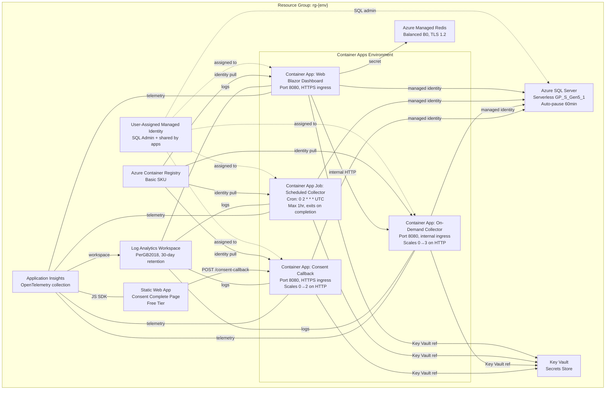
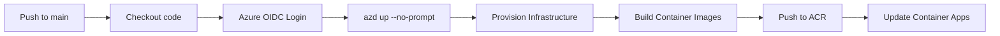

# Deployment Guide

## Azure Architecture



## Prerequisites

- [Azure CLI](https://learn.microsoft.com/cli/azure/install-azure-cli) installed
- [Azure Developer CLI (azd)](https://learn.microsoft.com/azure/developer/azure-developer-cli/install-azd) installed
- An Azure subscription with permissions to create resources
- An Azure AD multi-tenant app registration (see [Permissions](permissions.md))

## Deploy with azd

### 1. Authenticate

```powershell
azd auth login
```

### 2. Create an environment

```powershell
azd env new mau
```

### 3. Set configuration

```powershell
# Required: Azure AD app registration for Microsoft Graph access
azd env set AZURE_AD_CLIENT_ID "your-app-client-id"
azd env set AZURE_AD_CLIENT_SECRET "your-app-client-secret"
azd env set AZURE_AD_TENANT_ID "your-home-tenant-id"

# Required: Shared secret for consent callback HMAC validation
azd env set CONSENT_SHARED_SECRET "your-random-secret-string"

# Optional: Override defaults
azd env set AZURE_LOCATION "swedencentral"  # Default: swedencentral
```

### 4. Provision and deploy

```powershell
azd up
```

This single command:
1. Provisions all Azure resources via Bicep
2. Builds container images via .NET SDK publish
3. Pushes images to Azure Container Registry
4. Deploys the web container app, the on-demand collector, and the scheduled job

### 5. Register Redirect URIs in Entra ID

After deployment, register **two** redirect URIs in your app registration:

1. Run `azd env get-values` and find `CONSENT_STATIC_URI` and `WEB_URI`
2. Go to **Azure Portal → App registrations → your app → Authentication → Web → Redirect URIs**
3. Add both:
   - **Consent flow**: The Static Web App URL (e.g., `https://swa-consent-xxxxx.azurestaticapps.net`) — for admin consent redirect
   - **Dashboard login**: `{WEB_URI}/signin-oidc` (e.g., `https://ca-web-xxxxx.azurecontainerapps.io/signin-oidc`) — for user sign-in
4. Save

The consent URI is for the admin consent flow (tenant onboarding). The signin-oidc URI is for dashboard user authentication.

### 6. Verify deployment

After `azd up` completes, it outputs the web URL:
```
WEB_URI: https://ca-web-xxxxx.azurecontainerapps.io
```

## Infrastructure Details

### Azure SQL Database (Serverless)

- **SKU**: GP_S_Gen5_1 (General Purpose, Serverless, Gen5, 1 vCore)
- **Auto-pause**: 60 minutes of inactivity → pauses compute (storage-only cost)
- **Auto-resume**: First connection resumes compute (~1 min cold start)
- **Max size**: 32 GB
- **Authentication**: Azure AD only (Entra ID); a User-Assigned Managed Identity is set as AD admin automatically
- **Firewall**: Allows Azure services (Container Apps)
- **Connection**: `Active Directory Default` with UAMI client ID — no passwords or manual SQL grants needed
- **Resilience**: EF Core configured with `EnableRetryOnFailure` (5 retries, 30s max delay) and 60s command timeout to handle serverless cold-start resume

### Azure Managed Redis (Enterprise)

- **SKU**: Balanced_B0
- **TLS**: 1.2 minimum, encrypted client protocol
- **Clustering**: OSSCluster policy
- **Eviction**: VolatileLRU
- **Purpose**: Dashboard page caching, tenant metadata caching
- **Cache key prefix**: `MWDashboard:`

> **Note**: Azure Cache for Redis (Classic) was retired. This project uses `Microsoft.Cache/redisEnterprise` (Azure Managed Redis).

### Container App (Web)

- **Image**: `mwdashboard-web:latest`
- **Port**: 8080 (HTTPS ingress, external)
- **Scaling**: 1–3 replicas, scales on 50 concurrent HTTP requests
- **Resources**: 0.5 vCPU, 1 GB memory per replica
- **Identity**: System-Assigned (ACR pull, Key Vault access) + User-Assigned (SQL)
- **TLS**: Terminated at Container Apps ingress; app uses `UseForwardedHeaders` to trust `X-Forwarded-Proto` (ensures OIDC redirect URIs use `https://`)

### Container App Job (Collector)

- **Image**: `mwdashboard-job:latest`
- **Schedule**: `0 2 * * *` (daily at 2:00 AM UTC)
- **Timeout**: 3600 seconds (1 hour max)
- **Retry**: 1 retry on failure
- **Behaviour**: Runs, collects all tenant data, exits with code 0
- **Identity**: System-Assigned (ACR pull, Key Vault access) + User-Assigned (SQL)

### Container App (On-Demand Collector)

- **Image**: `mwdashboard-collector:latest`
- **Port**: 8080 (internal ingress only — not externally accessible)
- **Scaling**: 0–3 replicas, scales on 5 concurrent HTTP requests
- **Endpoint**: `POST /collect/{tenantId}?tenantName=...`
- **Purpose**: Isolates on-demand data collection from the Web app for independent scaling
- **Fallback**: If unreachable, the Web app falls back to local collection
- **Identity**: System-Assigned (ACR pull, Key Vault access) + User-Assigned (SQL)

### Container App (Consent Callback)

- **Image**: `mwdashboard-consent:latest`
- **Port**: 8080 (HTTPS ingress, external)
- **Scaling**: 0–2 replicas, scales on 10 concurrent HTTP requests
- **Endpoint**: `POST /consent-callback?tenant={tenantId}&token={hmac}`
- **Purpose**: Receives consent redirect callbacks from the Static Web App, validates HMAC, calls Graph `/organization` to verify consent and fetch tenant details, then auto-registers the tenant in the database and triggers initial data collection
- **CORS**: Configured to only accept requests from the Static Web App origin
- **Identity**: System-Assigned (ACR pull, Key Vault access) + User-Assigned (SQL)
- **Resources**: 0.25 vCPU, 0.5 GB memory

### Static Web App (Consent Complete Page)

- **SKU**: Free tier
- **Purpose**: Hosts the consent redirect landing page (`index.html`) — completely isolated from the dashboard, contains no customer data
- **Flow**: Azure AD redirects here after admin consent → page calls consent callback API → shows success/error
- **Telemetry**: Application Insights JavaScript SDK for client-side tracking
- **Security headers**: CSP, X-Frame-Options DENY, nosniff, strict referrer policy
- **Deploy**: `azd deploy consent-static` with predeploy hook that injects callback URL and shared secret

### Key Vault

- **Purpose**: Stores Azure AD Client ID, Client Secret, Redis connection string, and Consent Shared Secret
- **Access**: RBAC-based (Key Vault Secrets User role assigned to container app identities)
- **Soft delete**: Enabled (7-day retention)
- Secrets are referenced from Container Apps via `keyVaultUrl` — never stored as plain text in app config

### Application Insights (OpenTelemetry)

- **Type**: `Microsoft.Insights/components` (workspace-based)
- **Backend**: Linked to Log Analytics Workspace
- **SDK**: `Azure.Monitor.OpenTelemetry.AspNetCore` v1.5.0 in all services
- **Signals**: Distributed traces, metrics, logs, live metrics
- **Configuration**: Connection string passed as `APPLICATIONINSIGHTS_CONNECTION_STRING` environment variable
- **Cost**: Pay-per-GB ingestion (first 5 GB/month free)
- **Retention**: Inherits Log Analytics workspace retention (30 days)

### Managed Identities

| Identity | Type | Purpose |
|----------|------|---------|
| `id-{token}` | User-Assigned | SQL Server AD admin; assigned to all container apps for database access |
| Web (system) | System-Assigned | ACR image pull, Key Vault secrets reader |
| Job (system) | System-Assigned | ACR image pull, Key Vault secrets reader |
| Collector (system) | System-Assigned | ACR image pull, Key Vault secrets reader |
| Consent (system) | System-Assigned | ACR image pull, Key Vault secrets reader |

### Role Assignments (automated)

| Role | Assignee | Scope |
|------|----------|-------|
| AcrPull | Web system identity | Resource Group |
| AcrPull | Job system identity | Resource Group |
| AcrPull | Collector system identity | Resource Group |
| AcrPull | Consent system identity | Resource Group |
| Key Vault Secrets User | Web system identity | Resource Group |
| Key Vault Secrets User | Job system identity | Resource Group |
| Key Vault Secrets User | Collector system identity | Resource Group |
| Key Vault Secrets User | Consent system identity | Resource Group |

## CI/CD with GitHub Actions

### Overview

The pipeline at `.github/workflows/deploy.yml` runs on every push to `main` and deploys using `azd up` with OIDC federated credentials (no stored secrets for Azure auth).

### Setup Steps

#### 1. Create a Service Principal with federated credentials

```powershell
# Create the app registration
az ad app create --display-name "MWDashboard-Deploy"

# Note the appId from output, then create a service principal
az ad sp create --id <appId>

# Assign Contributor + AcrPush + RBAC Admin roles on your subscription
az role assignment create --assignee <appId> --role Contributor --scope /subscriptions/<subscriptionId>
az role assignment create --assignee <appId> --role AcrPush --scope /subscriptions/<subscriptionId>

# Required: The deployment creates role assignments (AcrPull, Key Vault Secrets User)
# for container app identities. Without this role, provisioning fails with:
# "does not have permission to perform action 'Microsoft.Authorization/roleAssignments/write'"
az role assignment create --assignee <appId> --role "Role Based Access Control Administrator" --scope /subscriptions/<subscriptionId>

# Configure federated credential for GitHub Actions
# (PowerShell requires a JSON file — inline JSON gets mangled by the shell)
@{
    name      = "github-main"
    issuer    = "https://token.actions.githubusercontent.com"
    subject   = "repo:<org>/<repo>:ref:refs/heads/main"
    audiences = @("api://AzureADTokenExchange")
} | ConvertTo-Json | Set-Content fed-cred.json

az ad app federated-credential create --id <appId> --parameters "@fed-cred.json"
Remove-Item fed-cred.json
```

#### 2. Configure GitHub repository

Add these as **Repository Variables** (Settings → Secrets and variables → Actions → Variables):

| Variable | Value |
|----------|-------|
| `AZURE_CLIENT_ID` | Service Principal appId (for OIDC login) |
| `AZURE_TENANT_ID` | Your Azure AD tenant ID |
| `AZURE_SUBSCRIPTION_ID` | Target Azure subscription |
| `AZURE_ENV_NAME` | Environment name (e.g., `prod`) |
| `AZURE_LOCATION` | Azure region (e.g., `swedencentral`) |
| `AZURE_AD_TENANT_ID` | Home tenant for Graph API access |

Add these as **Repository Secrets**:

| Secret | Value |
|--------|-------|
| `AZURE_AD_CLIENT_ID` | App registration Client ID (for Graph API) |
| `AZURE_AD_CLIENT_SECRET` | App registration Client Secret (for Graph API) |
| `CONSENT_SHARED_SECRET` | Shared secret for consent callback HMAC validation |

#### 3. Push to deploy

```bash
git add .
git commit -m "Deploy to Azure"
git push origin main
```

The workflow triggers automatically and runs `azd up --no-prompt`.

### Pipeline Flow



## Individual Operations

### Provision infrastructure only (no deploy)

```powershell
azd provision
```

### Deploy code only (infrastructure already exists)

```powershell
azd deploy
```

### Deploy a single service

```powershell
azd deploy web            # Deploy only the web app
azd deploy collector      # Deploy only the scheduled collector job
azd deploy ondemand       # Deploy only the on-demand collector
azd deploy consent        # Deploy only the consent callback API
azd deploy consent-static # Deploy only the static consent page
```

### Tear down all resources

```powershell
azd down
```

## Database Migrations

EF Core migrations are applied **automatically on startup** — both the Web container and the Job container call `db.Database.MigrateAsync()` before processing requests. When you push code with new migrations:

1. The CI/CD pipeline builds and deploys new container images
2. On first startup, the Web app applies any pending migrations to Azure SQL
3. New tables/columns are created automatically — no manual intervention needed

This means pushing a commit that includes a new migration will automatically update the database schema in Azure.

### Adding Migrations Locally

```powershell
cd src/MWDashboard.Web
dotnet ef migrations add <MigrationName> --project ../MWDashboard.Shared
```

### Current Schema (9 tables)

| Table | Purpose |
|-------|---------|
| `MauSnapshots` | Monthly active user counts per service per day |
| `Tenants` | Registered tenant info (ID, name, active status) |
| `LicenseSnapshots` | SKU license counts (total, consumed) over time |
| `MessageCenterPosts` | M365 Message Center announcements |
| `SecuritySignInSummaries` | Sign-in success/failure/MFA counts per day |
| `WorkloadActivities` | Feature-level usage (meetings, chats, files, emails) |
| `CopilotUsageSnapshots` | Copilot active users per app |
| `UserSegmentSnapshots` | User segmentation (heavy/light/inactive) |
| `DepartmentUsageSnapshots` | Per-department active vs total users |
| `StorageSnapshots` | Storage used per service (SharePoint, OneDrive, Exchange) |
| `ConsumptionSnapshots` | Computed consumption score with all dimensions |
| `M365AppUsageSnapshots` | M365 app platform usage (per-app, per-platform user counts) |

## Environment Variables (Runtime)

These are set automatically by the Bicep templates as Container App env vars and Key Vault-backed secrets:

| Variable | Source | Used by |
|----------|--------|---------|
| `ConnectionStrings__DefaultConnection` | Azure SQL connection string (includes UAMI client ID) | Web, Job, Collector, Consent |
| `ConnectionStrings__Redis` | Key Vault secret ref | Web |
| `AzureAd__ClientId` | Key Vault secret ref | Web, Job, Collector, Consent |
| `AzureAd__ClientSecret` | Key Vault secret ref | Web, Job, Collector, Consent |
| `AzureAd__TenantId` | Plain env var | Web, Job, Collector, Consent |
| `CollectorBaseUrl` | Internal FQDN of collector container | Web |
| `ConsentCallback__RedirectUri` | Static Web App URL | Web |
| `ConsentCallback__SharedSecret` | Key Vault secret ref | Consent |
| `Cors__AllowedOrigins__0` | Static Web App URL | Consent |
| `ASPNETCORE_ENVIRONMENT` | `Production` | Web, Collector, Consent |
| `APPLICATIONINSIGHTS_CONNECTION_STRING` | Application Insights connection string | Web, Job, Collector, Consent |

## Troubleshooting

| Issue | Resolution |
|-------|-----------|
| SQL cold start (~60s) on first request | Expected with Serverless tier; EF Core retry policy (5 retries, 30s delay) handles this automatically. Subsequent requests are fast |
| Job fails with timeout | Check tenant count; consider splitting into multiple jobs for >100 tenants |
| Container App not starting | Check Log Analytics for startup errors: `ContainerAppConsoleLogs_CL` |
| Redis connection refused | Verify firewall allows Azure services; check TLS settings |
| `azd up` fails on permissions | Ensure Service Principal has Contributor + AcrPush on the subscription |
| `azd up` fails with `Microsoft.Authorization/roleAssignments/write` | The deploying principal needs **Role Based Access Control Administrator** (or Owner) on the subscription because the template creates role assignments for container app identities. Fix: `az role assignment create --assignee <principalObjectId> --role "Role Based Access Control Administrator" --scope /subscriptions/<subscriptionId>` |
| `azd up` publish fails with `MSB3491` (file already exists) | Both services share `MWDashboard.Shared` and are published in parallel. The `prepackage` hook in `azure.yaml` pre-builds the solution to avoid this race condition. If it recurs, ensure the hook is present |
| SQL deploy fails with `InvalidExternalAdministratorSid` | The managed identity failed to provision before SQL. This should not occur with the current Bicep dependency chain; run `azd down --force` and retry |
| Redis deploy fails with `BadRequest` (retirement notice) | The classic `Microsoft.Cache/redis` resource type is retired. Use `Microsoft.Cache/redisEnterprise` (already updated in this repo) |
| Container App fails with `MANIFEST_UNKNOWN` | The image hasn't been pushed to ACR yet. The Bicep templates use a placeholder image for initial provisioning; ensure `azd deploy` runs after provision |
| `A resource with this name already exists` | A previous partial deploy left orphaned resources. Run `azd down --force` then `azd up` to start fresh |
| Key Vault soft-delete conflict | A previously deleted vault with the same name exists. Purge it: `az keyvault purge --name kv-{token}` |
